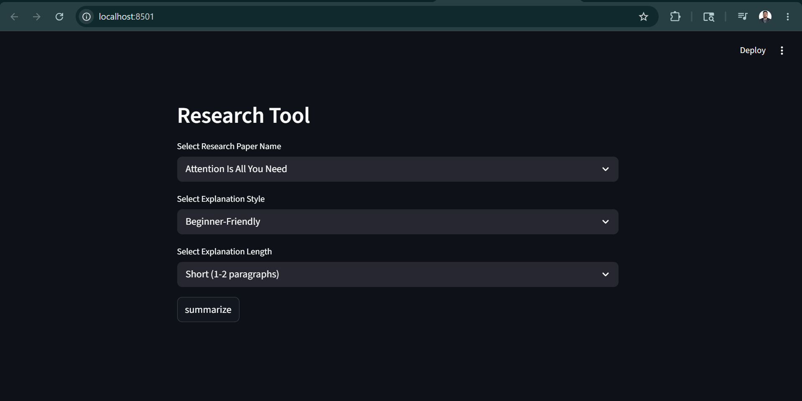

# 📚 Research Paper Summarizer

> An AI-powered web application that generates concise, meaningful summaries of research papers — based on paper title, explanation style, and desired summary length.

Built with **Python**, **Streamlit**, **LangChain**, and the **Gemini API**, this project helps users quickly grasp academic topics without reading full research papers.

---

## 🚀 Features

- 🔍 Generate summaries using only the research paper title
- 🎓 Select from multiple explanation styles:
  - Beginner Friendly
  - Technical
  - Academic
  - Simple Explanation
- 📏 Customize summary length:
  - Short
  - Medium
  - Detailed
- 🤖 AI-powered summarization via the Gemini API
- 🖥️ Interactive and clean Streamlit interface
- ⚡ Fast and easy-to-use workflow

---

## 🛠️ Tech Stack

| Layer | Technology |
|-------|-----------|
| Language | Python 3.10+ |
| UI Framework | Streamlit |
| LLM Orchestration | LangChain |
| AI Model | Google Gemini API |

---

## 📸 Demo



---

## 📁 Project Structure

```
Research_Paper_Summarizer/
├── prompt_generator.py   # Core prompt logic
├── prompt_ui.py          # Streamlit UI components
├── README.md
├── requirements.txt
├── template.json         # Prompt templates
└── images/
    └── Screenshot.png
```

---

## ⚙️ Installation

### 1️⃣ Clone the Repository

```bash
git clone https://github.com/your-username/research-paper-summarizer.git
cd research-paper-summarizer
```

### 2️⃣ Create a Virtual Environment

```bash
python -m venv venv
```

### 3️⃣ Activate the Virtual Environment

**Windows:**
```bash
venv\Scripts\activate
```

**macOS / Linux:**
```bash
source venv/bin/activate
```

### 4️⃣ Install Dependencies

```bash
pip install -r requirements.txt
```

### 5️⃣ Set Up Environment Variables

Create a `.env` file in the root directory and add your Gemini API key:

```env
GOOGLE_API_KEY=your_api_key_here
```

---

## ▶️ Usage

Run the Streamlit application:

```bash
streamlit run app.py
```

Then open the local URL displayed in your terminal:

```
http://localhost:8501
```

---

## 🧠 How It Works

1. Enter the research paper title
2. Choose your preferred explanation style
3. Select the desired summary length
4. The Gemini API processes the request
5. The generated summary is displayed instantly

---

## 📋 Requirements

- Python 3.10+
- `pip`
- Active internet connection
- Google Gemini API Key

---

## 📄 License

This project is open source. Feel free to fork, modify, and contribute!